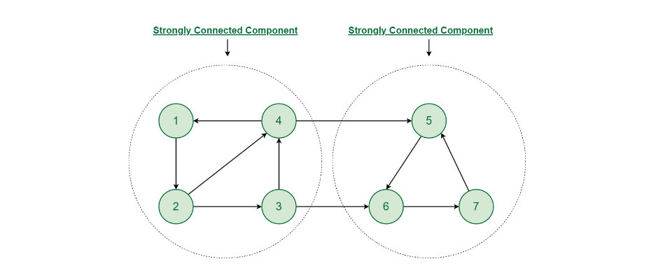

# Directed Graph Cycle Detection Code: (3 methods)

## 1. Using Color / DFS.

```
bool cycleCheck(vector<int>adj[],int node,vector<int>&color)
{
    bool check = 0;

    color[node]=1;
    for(auto ch:adj[node])
    {
        if(color[ch]==0)
        {
            check |= cycleCheck(adj,ch,color);
        }
        else if(color[ch]==1)
        {
            check = 1;
        }
    }

    color[node]=2;
    return check;
}

int main()
{
   vector<int>color(v,0);
    bool check = 0;
    for(int i=0;i<v;i++)
    {
        if(color[i]==0)
        {
            check |= cycleCheck(adj,i,color);
        }
    }
    //Check 1 then cycle.
    //check 0 then not cycle.

}
```

## 2. Using BFS or Kahn’s algorithm:

Uses the concept that if TOPOLIGICAL sort is possible then no cycle else cycle.

### Logic : Try to find the topological sort of the graph if it is possible then no cycle else cycle. So, create a indegree array and push all the nodes with indegree 0 in the queue and then pop the node and reduce the indegree of the child nodes and push the child nodes with indegree 0 in the queue and repeat the process until the queue is empty.

```
    bool isCyclic(int V, vector<int> adj[]) {
        vector<int>indegree(V,0);
        for(int i=0;i<V;i++)
        {
            for(auto ch:adj[i])
            {
                indegree[ch]++;
            }
        }
        queue<int>Q;
        for(int i=0;i<V;i++)
        {
            if(indegree[i]==0){
                Q.push(i);
            }
        }
        vector<int>topo;
        while(!Q.empty())
        {
            int node = Q.front();
            topo.push_back(node);
            Q.pop();
            for(auto ch:adj[node])
            {
                indegree[ch]--;
                if(indegree[ch]==0)
                {
                    Q.push(ch);
                }
            }
        }
        return topo.size()!=V;
    }

```

## 3. Using DFS/(visited & dfs_visited arrays ) :

Using similar concept as used in color .

```
    bool dfs(vector<int>adj[],int node,vector<int>&vis,vector<int>&dfs_vis)
    {
        vis[node] = 1;
        dfs_vis[node] = 1;
        bool check = 0;
        for(auto ch:adj[node])
        {
            if(!vis[ch])
            {
                check |= dfs(adj,ch,vis,dfs_vis);
            }
            if(dfs_vis[ch]==1)
            {
                check = 1;
            }
        }
        dfs_vis[node] = 0;
        return check;
    }

    bool isCyclic(int V, vector<int> adj[]) {
        vector<int>vis(V,0);
        vector<int>dfs_vis(V,0);
        bool check = 0;
        for(int i=0;i<V;i++)
        {
            if(!vis[i])
            {
                check |= dfs(adj,i,vis,dfs_vis);
            }
        }
        return check;

    }

```

# UNDIRECTED Graph Cycle Detection Code: (2 Method)

## 1. Using DFS & parent array.

1. First create a parent array.

2. Then for every child of a node, make parent of child = node and when you encounter the visited node check if parent[node]! =child, then it is a cycle.

```

    bool cycleCheck(vector<int>adj[],vector<int>&vis,vector<int>&parent,int node)
        {
            vis[node]=1;
            bool check  = 0;
            for(auto ch:adj[node])
            {
                if(!vis[ch])
                {
                    parent[ch]=node;
                    check |= cycleCheck(adj,vis,parent,ch);
                }
                else if(parent[node]!=ch)
                {
                    check = 1;
                }
            }
            return check;
        }
    int main()
    {
        vector<int>vis(V,0);
        vector<int>parent(V,-1);
        bool check = 0;
        for(int i=0;i<V;i++)
        {
            if(!vis[i])
            {
                check |= cycleCheck(adj,vis,parent,i);
            }
        }
        return check;
    }

```

## 2. Using BFS.

Uses same concept as dfs but traverse through bfs and queue is made of pair, <node,parent>

```

bool bfs(vector<int>edges[], vector<int> &vis, int idx) {
queue<pair<int, int>> Q;
Q.push({idx,-1});
while(!Q.empty())
{
pair<int,int> x = Q.front();
Q.pop();
vis[x.first]=1;
for(auto ch:edges[x.first])
{
if(vis[ch]==0)
{
vis[ch]=1;
Q.push({ch,x.first});
}
else if(x.second!=ch){

                    return 1;

            }
        }
    }
    return 0;

}

```

- ### OR you can use different parent array like DFS.

```
    // Function to detect cycle in an undirected graph.
    bool isCycle(int V, vector<int> adj[]) {
        vector<int>vis(V,0);
        vector<int>parent(V,-1);
        queue<int>Q;
        bool check = 0;
        for(int i=0;i<V;i++)
        {
            if(!vis[i])
            {
                Q.push(i);
                vis[i]=1;
                while(!Q.empty())
                {
                    int node = Q.front();
                    Q.pop();
                    for(auto ch:adj[node])
                    {
                        if(!vis[ch])
                        {
                            vis[ch] = 1;
                            parent[ch] = node;
                            Q.push(ch);
                        }
                        else
                        {
                            if(parent[node]!=ch)
                            {
                                check = 1;
                            }
                        }
                    }
                }
            }
        }
        return check;
    }
```

## 3. Count of all cycles without any inner cycle in a given Graph

- ### Given an undirected connected graph consisting of N vertices numbered [0, N-1] and E edges, the task is to count the number of cycles such that any subset of vertices of a cycle does not form another cycle.

- ### Since V vertices require V edges to form 1 cycle, the number of cycles in a connected graph can be expressed using the formula: (Edges - Vertices) + 1

---

## TOPOSORT CODE :

### 1. Using simple DFS and Reversing any of its DFS vectors , But you need to be sure that Cycle is not present in the graph AND It also work if you not start from root.

```

    void dfs(vector<int>adj[],vector<int>&vis,vector<int>&topo_sort,int node)
    {
        vis[node]=1;
        for(auto ch:adj[node])
        {
            if(!vis[ch])
            {
                dfs(adj,vis,topo_sort,ch);
            }
        }
        topo_sort.push_back(node);
    }
    vector<int> topoSort(int V, vector<int> adj[])
    {
        vector<int>topo_sort;
        vector<int>vis(V,0);
        for(int i=0;i<V;i++)
        {
            if(!vis[i])
            {
                dfs(adj,vis,topo_sort,0);
            }
        }
        reverse(topo_sort.begin(),topo_sort.end());
        return topo_sort;
    }

```

### 2. BFS TOPOSORT : (Using Indegree) Also Called Kahn's Algorithm

```

    vector<int> topoSort(int V, vector<int> adj[]) {
        vector<int>indegree(V,0);
        for(int i=0;i<V;i++)
        {
            for(auto ch:adj[i])
            {
                indegree[ch]++;
            }
        }
        queue<int>Q;
        for(int i=0;i<V;i++)
        {
            if(indegree[i]==0)
            {
                Q.push(i);
            }
        }
        vector<int>topo;
        while(!Q.empty())
        {
            int node = Q.front();
            topo.push_back(node);
            Q.pop();
            for(auto ch:adj[node])
            {
                indegree[ch]--;
                if(indegree[ch]==0)
                {
                    Q.push(ch);
                }
            }
        }
        return topo;
    }

```

## DSU (Disjoint set union) :

### What is a Disjoint set data structure?

- ### Two sets are called disjoint sets if they don’t have any element in common, the intersection of sets is a null set.

### What it is used for ?

- ### Consider a scenario where you have to find that two nodes belong to same components or not , DSU does it in O(1)

### DSU functoin provide :

### 1. Union : It is used to merge two sets.

### 2. Find : It is used to find the parent/Representative of the set.

### 3. MakeSet : It is used to create a set of a single element.

### DSU : Partitioning the individuals into different sets according to the groups in which they fall. This method is known as a Disjoint set Union which maintains a collection of Disjoint sets and each set is represented by one of its members call ultimate parent.

### Data Structure used for DSU :

1. ### Array : Parent[] : It is used to store the parent of the node.
2. ### Array : Rank[] : It is used to store the height of the tree.
   ### OR
3. ### Array : Size[] : It is used to store the size of the tree.
4. ### For DSU implementation, we need to create Three functions : Find and Union(Rank/size) and One for initialization of the parent of every node to itself and Size of Rank/Size vector

### Find opeartion :

```
        int findUpar(int node){
        if(node == parent[node])
        {
            return node;
        }
        return parent[node] = findUpar(parent[node]);//path compression

    }
        Time Complexity: O(log n) on average per call because of path compression without it O(n).
```

### Union operation (Two Ways) :

It is used to merge two sets which is nothind but two trees and make them one tree we have to just make the parent of every node of one tree to the parent of the other tree , So there are two ways to decide which tree come under other or which tree become parent of other tree.

- ### Union by Rank :

  Here rank[i] is the height of the tree representing the set containing i.
  If the rank of left is less than the rank of right, then it’s best to move left under right, because that won’t change the rank of right (while moving right under left would increase the height). In the same way, if the rank of right is less than the rank of left, then we should move right under left.
  If the ranks are equal, it doesn’t matter which tree goes under the other, but the rank of the result will always be one greater than the rank of the trees.

  ```
   void unionByRank(int u,int v){
        int ulp_u = findUpar(u);
        int ulp_v = findUpar(v);
        if(ulp_u == ulp_v)return;
        if(Rank[ulp_u]<Rank[ulp_v]){
           parent[ulp_u] = ulp_v;
        }
        else if(Rank[ulp_v]<Rank[ulp_u]){
            parent[ulp_v] = ulp_u;
        }
        else{
            parent[ulp_v] = ulp_u;
            Rank[ulp_u]++;
        }
    }
    Time Complexity: O(alpha(n)) on average per call because of path compression without it O(n).
  ```

- ### Union by Size :

  If i is a representative of a set, size[i] is the number of the elements in the tree representing the set.
  If the size of left is less than the size of right, then it’s best to move left under right and increase size of right by size of left. In the same way, if the size of right is less than the size of left, then we should move right under left. and increase size of left by size of right.
  If the sizes are equal, it doesn’t matter which tree goes under the other.

  ```
  void unionBySize(int u,int v){
  int ulp_u = findUpar(u);
  int ulp_v = findUpar(v);
  if(ulp_u == ulp_v)return;
  if(Size[ulp_u]<Size[ulp_v]){
  parent[ulp_u] = ulp_v;
  Size[ulp_v] += Size[ulp_u];
  }
  else {
  parent[ulp_v] = ulp_u;
  Size[ulp_u] += Size[ulp_v];
  }

      }
      Time complexity: O(log n) without Path Compression.
      Time complexity: O(alpha(n)) with Path Compression.
  ```

### Complete CODE :

```
    vector<int>Rank,parent;

    vector<int>Size;
    class DisjointSet{
    public:
    void print_rank(){
    for(int i=1;i<Size.size();i++)
    {
    cout<<Size[i]<<" ";
    }
    cout<<endl;
    }
    DisjointSet(int n){
    Rank.resize(n+1,0);
    Size.resize(n+1,1);
    parent.resize(n+1,0);
    for(int i=0;i<=n;i++){
    parent[i] = i;
    }
    }


    int findUpar(int node){
    if(node == parent[node])
    {
    return node;
    }
    return parent[node] = findUpar(parent[node]);//path compression

    }

        void unionByRank(int u,int v){
            int ulp_u = findUpar(u);
            int ulp_v = findUpar(v);
            if(ulp_u == ulp_v)return;
            if(Rank[ulp_u]<Rank[ulp_v]){
               parent[ulp_u] = ulp_v;
            }
            else if(Rank[ulp_v]<Rank[ulp_u]){
                parent[ulp_v] = ulp_u;
            }
            else{
                parent[ulp_v] = ulp_u;
                Rank[ulp_u]++;
            }
        }

    void unionBySize(int u,int v){
        int ulp_u = findUpar(u);
        int ulp_v = findUpar(v);
        if(ulp_u == ulp_v)return;
        if(Size[ulp_u]<Size[ulp_v]){
           parent[ulp_u] = ulp_v;
           Size[ulp_v] += Size[ulp_u];
        }
        else {
            parent[ulp_v] = ulp_u;
            Size[ulp_u] += Size[ulp_v];
        }

    }

};

```

---

# MST (Minimum Spanning Tree) , Two Algorithms :

- ## Kruskal Algorithm : (Uses DSU CONCEPT)

### Steps :

- ### Create a vector pair<int,pair<int,int>> = {weight,{node1,node2}}
- ### Then sort it according to the weight in ascending order.
- ### Then iterate through the sorted vector and Do union of the nodes if they are not in the same set and not if they are in same set (i.e if(parent[node1]!=parent[node2]) then do union of the nodes and add the weight to the answer.

```
// C++ program for the above approach

#include <bits/stdc++.h>
using namespace std;

// DSU data structure
// path compression + rank by union
class DSU {
	int* parent;
	int* rank;

public:
	DSU(int n)
	{
		parent = new int[n];
		rank = new int[n];

		for (int i = 0; i < n; i++) {
			parent[i] = -1;
			rank[i] = 1;
		}
	}

	// Find function
	int find(int i)
	{
		if (parent[i] == -1)
			return i;

		return parent[i] = find(parent[i]);
	}

	// Union function
	void unite(int x, int y)
	{
		int s1 = find(x);
		int s2 = find(y);

		if (s1 != s2) {
			if (rank[s1] < rank[s2]) {
				parent[s1] = s2;
			}
			else if (rank[s1] > rank[s2]) {
				parent[s2] = s1;
			}
			else {
				parent[s2] = s1;
				rank[s1] += 1;
			}
		}
	}
};

class Graph {
	vector<vector<int> > edgelist;
	int V;

public:
	Graph(int V) { this->V = V; }

	// Function to add edge in a graph
	void addEdge(int x, int y, int w)
	{
		edgelist.push_back({ w, x, y });
	}

	void kruskals_mst()
	{
		// Sort all edges
		sort(edgelist.begin(), edgelist.end());

		// Initialize the DSU
		DSU s(V);
		int ans = 0;
		cout << "Following are the edges in the "
				"constructed MST"
			<< endl;
		for (auto edge : edgelist) {
			int w = edge[0];
			int x = edge[1];
			int y = edge[2];

			// Take this edge in MST if it does
			// not forms a cycle
			if (s.find(x) != s.find(y)) {
				s.unite(x, y);
				ans += w;
				cout << x << " -- " << y << " == " << w
					<< endl;
			}
		}
		cout << "Minimum Cost Spanning Tree: " << ans;
	}
};

// Driver code
int main()
{
	Graph g(4);
	g.addEdge(0, 1, 10);
	g.addEdge(1, 3, 15);
	g.addEdge(2, 3, 4);
	g.addEdge(2, 0, 6);
	g.addEdge(0, 3, 5);

	// Function call
	g.kruskals_mst();

	return 0;
}

```

### Complexity Analysis :

- Time Complexity: O(E _ logE) or O(E _ logV)

  1. Sorting of edges takes O(E \* logE) time.
  2. After sorting, we iterate through all edges and apply the find-union algorithm. The find and union operations can take at most O(logV) time.
  3. So overall complexity is O(E _ logE + E _ logV) time.
     The value of E can be at most O(V2), so O(logV) and O(logE) are the same. Therefore, the overall time complexity is O(E * logE) or O(E*logV)

- Auxiliary Space: O(V + E), where V is the number of vertices and E is the number of edges in the graph.

- ## Prim Algorithm :

1. Create a priority queue of pair<int,pair<int,int>> => {wt,{node,parent}} .
2. Run simple BFS and circle can't be formed in MST because BFS is used and visited array is used

```
    #include <bits/stdc++.h>
vector<pair<pair<int, int>, int>> calculatePrimsMST(int n, int m, vector<pair<pair<int, int>, int>> &g)
{
    vector<pair<int,int>>graph[n+1];
    for(int i=0;i<m;i++)
    {
        graph[g[i].first.first].push_back({g[i].first.second,g[i].second});
        graph[g[i].first.second].push_back({g[i].first.first,g[i].second});
    }
    priority_queue<pair<pair<int,int>,int>, vector<pair<pair<int,int>,int>>, greater<pair<pair<int,int>,int>>> Q;
    Q.push({{0,1},-1});
    vector<pair<pair<int, int>, int>>ans;
    vector<int>vis(n+1,0);
    while(!Q.empty())
    {
       auto it = Q.top();
       Q.pop();
       int node = it.first.second;
       int paren = it.second;
       int wt = it.first.first;
       if(vis[node]==1)continue;
       if(paren!=-1)
       {
       ans.push_back({{node,paren},wt});
       }
       vis[node] = 1;
       for(auto ch:graph[node])
       {
           int adjNode = ch.first;
           if(vis[adjNode]==0)
           {
             Q.push({{ch.second,adjNode},node});
           }
       }
    }
    return ans;
}
```

---

# Bridge :

A Bridge is an edge which upon removing increase the number of componenets in graph.

- ### Tarjan Algorithm :

Steps to find bridges in GRAPH : (DFS used)

1. Create 3 vectors (Discover, low, vis) And parent , timer variable.
2. Discover : It stores the first time to reach any node , low : It stores the minimum time to reach node from any neighbour node and not parent of that node .
3. initialize parent = -1 it is parent of starting node run dfs , in
4.

```
void dfs(int node,int parent,int timer,vector<int>&dis,vector<int>&low,vector<vector<int>>&res,vector<int>graph[],vector<int>&vis)
{
    vis[node] = 1;
    dis[node]=low[node]=timer++;
    for(auto ch:graph[node])
    {
        if(ch==parent)continue;
        if(vis[ch]==0){
            dfs(ch,node,timer,dis,low,res,graph,vis);
            low[node] = min(low[ch],low[node]);
            if(low[ch]>dis[node]){
                res.push_back({ch,node});
            }
        }
        else{
            low[node] = min(low[node],low[ch]);
        }
    }
}

```

ALGO :

```
#include<bits/stdc++.h>

void dfs(int node,int parent,int timer,vector<int>&dis,vector<int>&low,vector<vector<int>>&res,vector<int>graph[],vector<int>&vis)
{
    vis[node] = 1;
    dis[node]=low[node]=timer++;
    for(auto ch:graph[node])
    {
        if(ch==parent)continue;
        if(vis[ch]==0){
            dfs(ch,node,timer,dis,low,res,graph,vis);
            low[node] = min(low[ch],low[node]);
            if(low[ch]>dis[node]){
                res.push_back({ch,node});
            }
        }
        else{
            low[node] = min(low[node],low[ch]);
        }
    }
}

vector<vector<int>> findBridges(vector<vector<int>> &edges, int v, int e) {
    vector<int>graph[v];
    for(int i=0;i<e;i++)
    {
        int u = edges[i][0];
        int v = edges[i][1];
        graph[u].push_back(v);
        graph[v].push_back(u);
    }
    vector<int>vis(v,0);
    vector<int>dis(v,0);
    vector<int>low(v,0);
    int parent = -1;
    vector<vector<int>>result;
    int timer = 0;
    for(int i=0;i<v;i++)
    {
        if(!vis[i]){
            dfs(i,parent,timer,dis,low,result,graph,vis);
        }
    }
    return result;
}
```

---

# Algorithm to find minimum distance of every node from source :(Dijkstra Algorithm, Bellman Ford Algorithm AND Toposort + Relaxation of nodes)

- ## Dijkstra Algorithm :(Can’t handle negative edges and negative cycle if negative edge is present then it give incorrect answer and if negative cycle is present then it goes in infinite loop)

Used to find minimum distance of every node from source and can’t handle negative edges as well as negative cycle because it uses greedy approach i.e if minimum distance of node is found then it is not updated again.

Steps : (Still to write)

```

//Here adjacent list in the form of vector<vector<int>>adj[]
int MAX_INT = 1000000;
vector <int> dijkstra(int V, vector<vector<int>> adj[], int S)
{
priority_queue<pair<int,int>, vector<pair<int,int>>, greater<pair<int,int>>>pq;
vector<int>dist(V,INT_MAX);
pq.push({0,S});
dist[S]=0;
while(!pq.empty())
{
auto temp = pq.top();
pq.pop();
auto node = temp.second;
auto cur_node_dist = temp.first;
if(dist[node]<cur_node_dist)continue;
for(auto ch:adj[node])
{
int child_dist = cur_node_dist + ch[1];
if(child_dist<dist[ch[0]])
{
dist[ch[0]] = child_dist;
pq.push({child_dist,ch[0]});
}
}

     }
     return dist;

}
O((V+E)*logv) ->
1 Extracting the minimum distance vertex also takes O(log V) time.
2 Each vertex is extracted once, and each edge is relaxed at most once.
3 Therefore, the total time for all extractions is O(V log V).
4 The total time for all edge relaxations is O(E log V).

```

- ## Bellman Ford Algorithm : (Can handle negative edges and negative cycle which means it is capable of detecting that negative cycle if it is present and if only negative edge is present then it can handle it and give correct answer)

Steps :

1. Create a vector dist of size V and initialize it with INT_MAX and dist[source] = 0.
2. Run a loop V-1 times and relax all the edges (i.e For each edges (u,v) with weight 'w' if dist[u] + wt < dist[v] then dist[v] = dist[u] + wt).
3. Run a loop Vth time and if any edge is relaxed then it means negative cycle is present.

```
vector<int> bellmonFord(int n, int m, int src, vector<vector<int>> &edges) {
    vector<int>dist(n+1,100000000);

    dist[src] = 0;

    for(int j=0;j<n;j++)
    {
        for(int i=0;i<m;i++)
        {
            int a = edges[i][0];
            int b = edges[i][1];
            int w = edges[i][2];

            if( dist[a]!=100000000 && dist[a] +w<dist[b] )
            {
                dist[b] = dist[a] +w;
            }
        }
    }


    return dist;

}
```

- ## Toposort + Relaxation of nodes (Can't handle neither negative cycle not positive cycle because then toposort is not possible , But can handle negative edges) : Time Complexity : O(V+E) {Most efficient}

### Used to find **minimum/maximum** distance of every node from source.

Steps :

1. Create a Toposort of the graph and stores it in an Vector.
2. Initialize the distance of source node to 0 and all other nodes to INT_MAX.
3. Run a loop of toposort and relax all the edges of the node , if dist[u] + wt < dist[v] then dist[v] = dist[u] + wt.

```
void dfs(vector<pair<int, int>>graph[],int node,vector<int>&vis,vector<int>&topo)
{
    vis[node]=1;
    for(auto ch: graph[node])
    {
        if(vis[ch.first]==0){
            dfs(graph,ch.first,vis,topo);
        }
    }
    topo.push_back(node);
}

vector<int> findMaxDistances(int n, int src, vector<vector<int>> &edges) {
    vector<pair<int, int>> graph[n];
    for (int i = 0; i < edges.size(); i++) {
        int u = edges[i][0];
        int v = edges[i][1];
        int wt = edges[i][2];
        graph[u].push_back({v, wt});
    }
    vector<int>topo;
    vector<int>vis(n,0);
    dfs(graph,src,vis,topo);
    reverse(topo.begin(),topo.end());
    vector<int> dist(n, 100000000);
    dist[src] = 0;

    for(int i=0;i<topo.size();i++)
    {
        int node = topo[i];
        for(auto ch:graph[node]){
            if(dist[ch.first]>dist[node]+ch.second){
                dist[ch.first] = dist[node]+ch.second;
            }
        }
    }
    return dist;
}
```

## TO check Negative weighted cycle use Bellman Ford Algorithm :

## Floyd Warshall Algorithm : (Used to find minimum distance of every node from every node)

Works well with graphs that have negative weight edges, as long as there are no negative weight cycles.
Uses DP
Time Complexity: O(V^3), where V is the number of vertices. This makes it less efficient for very large graphs but acceptable for dense graphs or graphs with a small number of vertices.
Space Complexity: O(V^2) to store the distance matrix.

### One Thing To remember if that K which is the intermediate node should be the outermost loop.

```
#include <bits/stdc++.h>
using namespace std;

void shortest_distance(vector<vector<int>> &matrix)
{
int n = matrix.size();

for (int k = 0; k < n; k++)
{
    for (int i = 0; i < n; i++)
    {
        for (int j = 0; j < n; j++)
        {
            if (matrix[i][k] != -1 && matrix[k][j] != -1)
            {
                if (matrix[i][j] == -1 || matrix[i][k] + matrix[k][j] < matrix[i][j])
                {
                    matrix[i][j] = matrix[i][k] + matrix[k][j];
                }
            }
        }
    }
}
}

```

## Strongly Connected Component / Kosaraju Algorithm , (Directed Graph) :



Two Strongly Connected Component Connected in only one direction , if connected in both direction then whole graph become SCC

- ### SCC is a group of nodes in a directed graph that are reachable from every other node in the group.
- ### Kosaraju Algorithm is used to find No. SCC in a directed graph.
- ### Steps :

1. Run DFS on the graph and store the order of nodes in a stack (stack conatains Toposort).
2. Reverse the graph.
3. Run DFS on the reversed graph and pop the nodes from the stack and No. of time you do dfs is the No. of SCC.

#### Logic : We don't do toposort of graph exactly , toposort is not possible because of presence of cycle in the graph , We do it to find the one element of scc before the other element of second scc because if you consider one scc as a single node then you can see that toposort is possible becuase interconnection between SCC's in one directional.

#### Two different dfs are used for step 1 and 3.

```
void dfs(int node,vector<int>&vis,vector<vector<int>>&graph,stack<int>&st)
    {
        vis[node] = 1;
        for(auto ch: graph[node])
        {
            if(!vis[ch]){
                dfs(ch,vis,graph,st);
            }
        }
        st.push(node);
    }

    void Dfs(int node,vector<int>graph[],vector<int>&vis)
    {
        vis[node]=1;
        for(auto ch:graph[node])
        {
            if(!vis[ch])
            {
                Dfs(ch,graph,vis);
            }
        }
    }

    int kosaraju(int V, vector<vector<int>>& adj)
    {
        vector<int>rev_graph[V];
        for(int i=0;i<V;i++)
        {
            for(auto ch:adj[i])
            {
                rev_graph[ch].push_back(i);
            }
        }

        stack<int>st;
        vector<int>vis(V,0);

        for(int i=0;i<V;i++)
        {
            if(!vis[i])
            {
                dfs(i,vis,adj,st);
            }
        }

        vis.clear();
        vis.resize(V,0);
        int ans = 0;
        while(!st.empty())
        {
            int node = st.top();
            st.pop();
            if(!vis[node])
            {
                ans++;
                Dfs(node,rev_graph,vis);
            }
        }
        return ans;

    }
```

---

# M-Coloring Problem : (Graph Coloring)

- ### This can be asked in two ways :
  1. Is it possible to color the graph with m colors.
  2. Minimum no. of colors required to color the graph.
  - ### Is it possible to color the graph with m colors.
    - #### problem statement : Given an undirected graph and an integer M. The task is to determine if the graph can be colored with at most M colors such that no two adjacent vertices of the graph are colored with the same color. Here coloring of a graph means the assignment of colors to all vertices. Print 1 if it is possible to colour vertices and 0 otherwise.

Logic :

1. We will use backtracking to solve this problem.
2. We will start from the first node and check if we can color it with any color.
3. If we can color it with any color then we will move to the next node and if any eher further we are not able to color any node then we will backtrack and change the color of the previous node.
4. We will keep on doing this until we reach the last node and if we are able to color all the nodes then we will return 1 else 0.

**Time complexity : O(M^N) where N is the number of nodes and M is the number of colors , For both adjency matrix and adjency List**
Why ? Becuase Every node has M choices to color and we have N nodes.
Space complexity : O(N) + O(N) because we are using a color array of size N and stack space of size N (recursion stack space).

#### Time Complexity Calculation : Total Number of nodes = (M^0 + M^1 + M^2 + M^3 + M^4 ....) = (M^N - 1)/(M-1) = O(M^N)

```
  #include <bits/stdc++.h>
using namespace std;

bool check(int node, bool graph[101][101], int n, int c, vector<int> &color)
{
    for (int i = 0; i < n; i++)
    {
        if (graph[i][node] || graph[node][i])
        {
            if (c == color[i])
                return 0;
        }
    }
    return 1;
}

bool dfs(int node, bool graph[101][101], int m, int n, vector<int> &color)
{
    if (node == n)
    {
        return 1;
    }

    for (int i = 0; i < m; i++)
    {
        if (check(node, graph, n, i, color))
        {
            color[node] = i;
            if (dfs(node + 1, graph, m, n, color))
            {
                return 1;
            }
        }
    }

    return 0;
}

bool graphColoring(bool graph[101][101], int m, int n)
{
    vector<int> color(n, -1);
    bool check = 1;

    check = (1 && dfs(0, graph, m, n, color));

    return check;
}
```

# Bipartite Graph : (Same For Two Clique Problem) , For Undirected Graph

- ## Graph which vertices can be partioned into two disjoint sets such that every edge connects a vertex from one set to another set , Or we can say that graph can be colored with two colors.

- ## Two ways to check Bipartite Graph :
  ### 1. If Graph has any odd length cycle then it is not Bipartite Graph.
  ### 2. If Graph can be colored with two colors then it is Bipartite Graph.
- #### ODD Length checking :
  - #### ⭐*THIS IS ALSO SOLVED BY TWO COLOR METHODS.*
- #### TWO COLOR METHOD (Time COmplexity : O(V+E) adjency list and O(V^2) for adjency matrix.)

  ### 1. DFS

```
#include<bits/stdc++.h>

bool dfs(int node,vector<int>graph[],vector<int>&color,int c)
{
	bool ans = 1;
	for(auto ch:graph[node])
	{
		if(color[ch]==-1)
		{
			color[ch] = 1-c;
			ans &= (dfs(ch,graph,color,1-c));

		}
		else if(color[ch]==c){
			return 0;
		}
	}
	return ans;
}

bool isGraphBirpatite(vector<vector<int>> &edges) {
	int n = edges.size();
	vector<int>graph[n];
	for(int i=0;i<n;i++)
	{
		for(int j=0;j<n;j++)
		{
			if(edges[i][j])
			{
				if(i==j)return 0; //Retrun False If self loop , because then it can't be BIPARTITE
				graph[i].push_back(j);
				graph[j].push_back(i);
			}
		}
	}

	vector<int>color(n,-1);
	bool ans = 1;
	for(int i=0;i<n;i++)
	{
		if(color[i]==-1)
		{
			color[0];
			ans &=(dfs(i,graph,color,0));
		}
	}
	return ans;
}
```

### 2. BFS

```
#include<bits/stdc++.h>


bool isGraphBirpatite(vector<vector<int>> &edges) {
	int n = edges.size();
	vector<int>graph[n];
	for(int i=0;i<n;i++)
	{
		for(int j=0;j<n;j++)
		{
			if(edges[i][j])
			{
				if(i==j)return 0; //Retrun False If self loop , because then it can't be BIPARTITE
				graph[i].push_back(j);
				graph[j].push_back(i);
			}
		}
	}

	vector<int>color(n,-1);
	for(int i=0;i<n;i++)
	{
		if(color[i]==-1)
		{
			color[i] = 0;
			queue<int>Q;
			Q.push(i);
			while(!Q.empty())
			{
				int node = Q.front();
				Q.pop();
				for(auto ch:graph[node])
				{
					if(color[ch]==-1)
					{
						color[ch] = 1-color[node];
						Q.push(ch);
					}
					else{
						if(color[ch]==color[node]){
							return 0;
						}
					}
				}
			}
		}

	}
	return 1;
}
```

# Path And Cycle Problems(Undirected Graph) : (Cycle is also called circuit)

- ## Eulerian Path AND Eulerian Cycle , (NP COmplete Problem) :

  ### 1. Eulerian Path : A path that visits every edge exactly once.

  - #### Eulerian Path: An undirected graph has Eulerian Path if following two conditions are true.

    - #### If Graph is connected and **exactly two vertices have odd degree** and all other vertices have even degree then there must be an Eulerian Path.

  ### 2. Eulerian Cycle : A cycle that visits every edge exactly once and returns to the starting point.

  - #### Eulerian Cycle: An undirected graph has Eulerian cycle if following two conditions are true.

    - #### Graph must be connected and all vertices have even degree .

  - ## Chinese Postman Problem (Variation of Eulerian Cycle) :

    - #### The Chinese Postman Problem is a famous problem in graph theory. The problem is to find the shortest path that visits every edge of a (connected) undirected graph at least once and returns to the starting vertex. The problem is also known as the Route Inspection Problem.
    - #### Solution :

      ```
      Still to write
      ```

- ## Hamiltonian Path AND Hamiltonian Cycle(NP COMPLETE Problem ) :

  ### 1. Hamiltonian Path : A path that visits every vertex exactly once.

  ### Time Complexity : O(V!) {Back Tracking}

  ```

    bool dfs(int node,vector<int>graph[],vector<int>&vis)
    {
        if(vis==vector<int>(vis.size(),1)){
            return 1;
        }

        for(auto ch:graph[node])
        {
            if(!vis[ch]){
                vis[ch] = 1;
                if(dfs(ch,graph,vis))
                {
                    return 1;
                }
                vis[ch] = 0;
            }
        }

        return 0;
    }

    bool check(int N,int M,vector<vector<int>> Edges)
    {
        vector<int>graph[N+1];
        for(int i=0;i<M;i++)
        {
            graph[Edges[i][0]].push_back(Edges[i][1]);
            graph[Edges[i][1]].push_back(Edges[i][0]);
        }

        bool ans = 0;
        for(int i=1;i<=N;i++)
        {
            vector<int>vis(N+1,0);
            vis[0]=1;
            vis[i]=1;
            ans |= dfs(i,graph,vis);
            vis[i]=0;
        }
        return ans;
    }
  ```

  ### 2. Hamiltonian Cycle : A cycle that visits every vertex exactly once and returns to the starting point.

  Time Complexity : O(N!)

  - ## Travelling Salesman Problem :

## Articulation Point : (LEFT)

## Maximum Bipartite Matching : (LEFT)

## Maximum Flow : (LEFT)

## Minimum Cut : (LEFT)

## KMP Algorithm : (LEFT)

## Rabin Karp Algorithm : (LEFT)

## Z Algorithm : (LEFT)

## Manacher Algorithm : (LEFT)

## Aho Corasick Algorithm : (LEFT)

## Suffix Array : (LEFT)

## Heap Code :

### Heapify

```

void heapify(vector<int>&nums,int n,int i)
{
int left = 2*i+1;
int right = 2*i+2;
int largest = i;
if(left<n && nums[largest]<nums[left])
{
largest = left;
}
if(right<n && nums[largest]<nums[right])
{
largest = right;
}
if(largest!=i)
{
swap(nums[largest],nums[i]);
heapify(nums,n,largest); }}

void buildHeap(int arr[],int n){
for(int i=n/2;i>0;i--)
{
Heapify(arr,n,i);
}
}
O(n) -> time complexity

```

## TRIE : (Dictonary Code)

```

#include<bits/stdc++.h>
using namespace std;

struct Node{
Node\* links[26];
bool flag = false;

    bool containKey(char ch)
    {
        return links[ch-'a']!=NULL;
    }

    void put(char ch,Node* node)
    {
        links[ch-'a'] = node;
    }

    Node* get(char ch)
    {
        return links[ch-'a'];
    }

    void setEnd()
    {
        flag = true;
    }

    bool isEnd()
    {
        return flag;
    }

};

class Trie{
private:
Node _root;
public:
Trie(){
root = new Node();
}
void insert(string word){
Node_ node = root;
for(int i=0;i<word.size();i++)
{
if(!node->containKey(word[i]))
{
node->put(word[i],new Node());
}
node = node->get(word[i]);
}
node->setEnd();
}
bool search(string word){
Node*node = root;
for(int i=0;i<word.size();i++)
{
if(!node->containKey(word[i]))
{
return 0;
}
else{
node = node->get(word[i]);
}
}
return node->flag;
}
bool startsWith(string prefix){
Node *node = root;
for(int i=0;i<prefix.size();i++)
{
if(!node->containKey(prefix[i]))
{
return 0;
}
else{
node = node->get(prefix[i]);
}
}
return 1;
}
};
Trie(Max Xor Code) :
class Node{
public:
Node* links[2];
void put(int i,Node* node)
{
links[i] = node;
}
Node\* get(int i)
{
return links[i];
}
bool containKey(int i)
{
return links[i]!=NULL;
}
};

class Trie{
private:
Node* root = new Node();
public:
void insert(int num)
{
Node* node = root;
int temp = num;
for(int i=31;i>=0;i--)
{
int bit = (temp & (1<<i))?(1):0;
if(!node->containKey(bit))
{
node->put(bit,new Node());
}
node = node->get(bit);
}
}
int Xor(int num)
{
int ans = 0;
Node\* node = root;
int temp = num;
for(int i=31;i>=0;i--)
{
int bit = (temp & (1<<i))?(1):0;
int rev_bit = !bit;

            if(node->containKey(rev_bit))
            {
                node = node->get(rev_bit);
                ans += pow(2,i);
            }
            else
            {
                node = node->get(bit);
            }
        }
        return ans;
    }
     int findMaximumXOR(vector<int>& nums) {
        Trie trie;
        int n = nums.size();
        for(int i=0;i<n;i++)
        {
            trie.insert(nums[i]);
        }
        int maxi = 0;
        for(int i=0;i<n;i++)
        {
            maxi = max(maxi,trie.Xor(nums[i]));
        }
        return maxi;

    }

};

```

## MergeSort : (O(logn)(n))

```

void merge(vector<int>&arr,int l1,int r1,int l2,int r2)
{
int n = r1-l1+1;
int m = r2-l2+1;
int a1[n],a2[m];
int j = 0;
for(int i=l1;i<=r1;i++)
{
a1[j] = arr[i];
j++;
}
j=0;
for(int i=l2;i<=r2;i++)
{
a2[j] = arr[i];
j++;
}
int k = l1;
int i=0;
j=0;
while(i<n && j<m)
{
if(a1[i]<=a2[j])
{
arr[k] = a1[i];
i++; k++;
}
else if(a1[i]>a2[j])
{
arr[k] = a2[j];
j++;
k++;
}
}
while(i<n){
arr[k] = a1[i];
k++;i++;
}
while(j<m){
arr[k] = a2[j];
k++; j++;
}
}

void mergeSort(vector<int>&arr,int left,int right)//arr,0,arr.size()
{
if(left<right)
{
int mid = (left + right)/2;
mergeSort(arr,left,mid);
mergeSort(arr,mid+1,right);
merge(arr,left,mid,mid+1,right);
}
}

```

```

```

```

```
