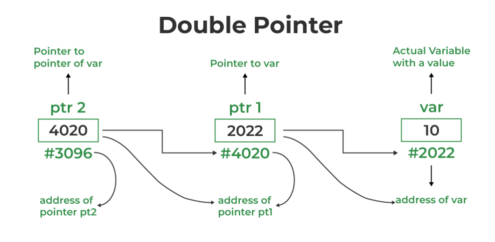
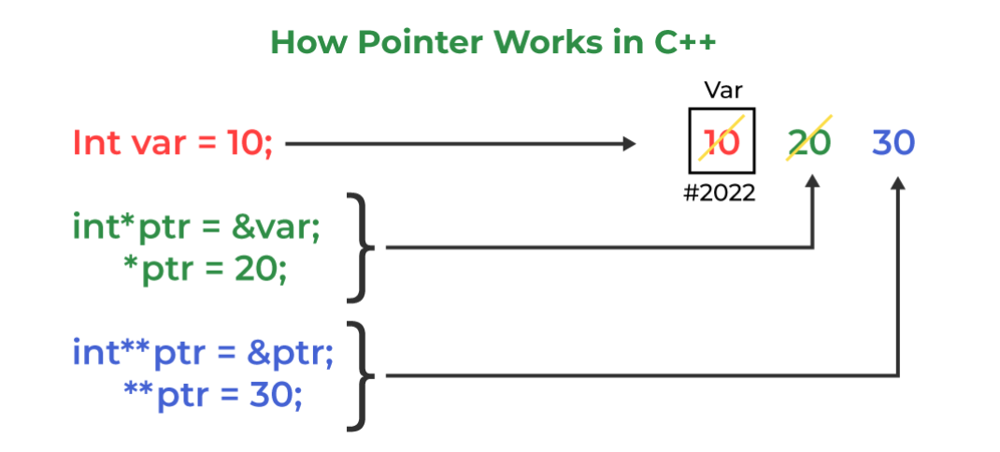

# Basic LL syntax :

```cpp
#include <bits/stdc++.h>
using namespace std;

class Node
{
public:
    int data;
    Node *next;
};

Node *head = NULL;

void insert(int data)
{
    Node *temp = new Node();
    temp->data = data;
    temp->next = head;
    head = temp;
}

void print()
{
    Node *temp = head;
    while (temp != NULL)
    {
        cout << temp->data << " ";
        temp = temp->next;
    }
}

int main()
{
    insert(1);
    insert(2);
    insert(3);
    insert(4);
    insert(5);
    insert(6);
    insert(7);
    insert(8);
    insert(9);
    insert(10);
    cout << "Original Linked List: ";
    print();
    cout << endl;


    return 0;
}

```

# Cycle Detection in Linked List

## How Fast and Slow Method Work

# Double Pointer

### we already know that a pointer stores the memory address of other variables. So, when we define a pointer to a pointer, the first pointer is used to store the address of the variables, and the second pointer stores the address of the first pointer. For this very reason, this is known as a Double Pointer or Pointer to Pointer.





## What will be the size of a pointer to a pointer in C++?

### In the C++ programming language double pointer behave similarly to a normal pointer. So, the size of the variable of the double-pointer and the size of the normal pointer variable is always equal.

```cpp
// C++ program to implement
// pointer to pointer
#include <bits/stdc++.h>
using namespace std;

// Driver code
int main()
{
int variable = 169;

// Pointer to store the address
// of variable
int* pointer1;

// double pointer to store the
// address of pointer1
int** pointer2;

// Storing address of variable
// in pointer1
pointer1 = &variable;

// Storing address of pointer1
// in pointer2
pointer2 = &pointer1;

// Displaying the value of variable
// with using both single and double
// pointers.
cout << "Value of variable :- " <<
		variable << "\n";
cout << "Value of variable using single pointer :- " <<
		*pointer1 << "\n";
cout << "Value of variable using double pointer :- " <<
		**pointer2 << "\n";
return 0;
}
```
